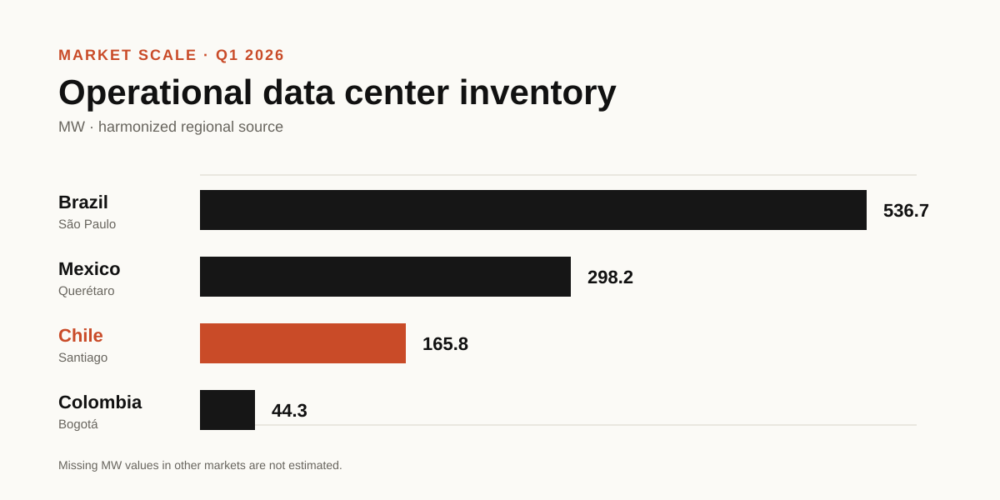
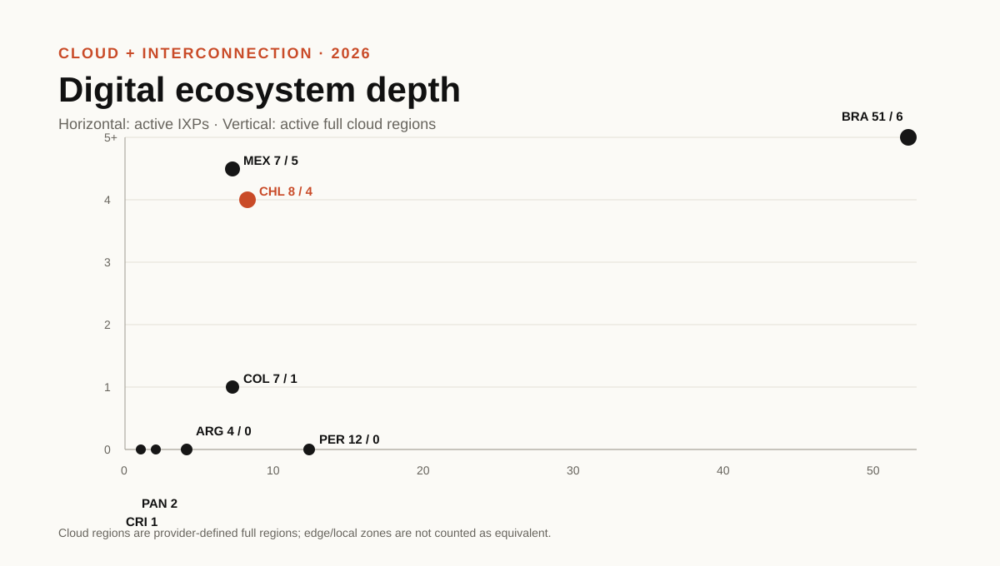
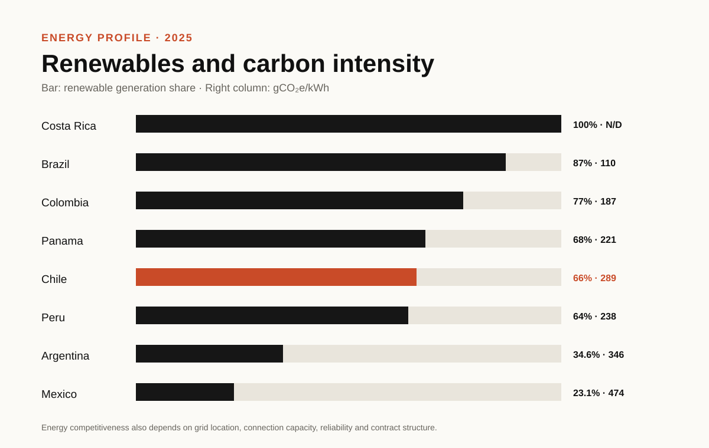

# Latin America Digital Infrastructure

Public, source-backed observatory for comparing digital infrastructure across Latin America.

The current release covers eight benchmark markets — Argentina, Brazil, Chile, Colombia, Costa Rica, Mexico, Panama and Peru — and combines country indicators with separate datasets for cloud, Internet exchange, submarine connectivity and operator market presence.

## Regional snapshot

- 8 benchmark markets
- 27 comparable variables
- 16 active full cloud regions
- 92 active IXPs
- 1,045 MW of comparable operational data-center inventory across four harmonized markets

## Visual analysis







## Current release — v0.2

Start with:

- `PROJECT_OVERVIEW.md` — project scope and benchmark markets
- `data/regional_benchmark_2026.csv` — 27 comparable variables across eight countries
- `data/cloud_regions.csv` — AWS, Google Cloud, Microsoft Azure and Oracle Cloud Infrastructure
- `data/ixps.csv` — initial Internet exchange inventory
- `data/submarine_cables.csv` — selected regional submarine systems
- `data/operator_country_presence.csv` — public operator presence by country and market
- `docs/key_findings.md` — principal analytical findings
- `docs/country_profiles.md` — eight concise country profiles
- `docs/data_dictionary.md` — field definitions
- `docs/methodology.md` — evidence and comparability rules
- `site/` — static observatory website prepared for publication
- `CHANGELOG.md` — release history

## Reproducibility

Run:

```bash
python scripts/benchmark_summary.py
python scripts/coverage_summary.py
```

GitHub Actions runs the same checks on pushes and pull requests.

## Research principles

The repository keeps infrastructure categories separate, uses harmonized comparisons only when definitions are sufficiently comparable, preserves missing values instead of estimating them, and distinguishes operational from announced infrastructure.

The public release is intentionally analytical rather than a directory of individual facilities.

## Author

Sebastian Elgueta Godoy

Sociology, public policy, telecommunications and digital infrastructure.

## License

MIT for repository code. Third-party source data remain subject to the terms of their original publishers.
