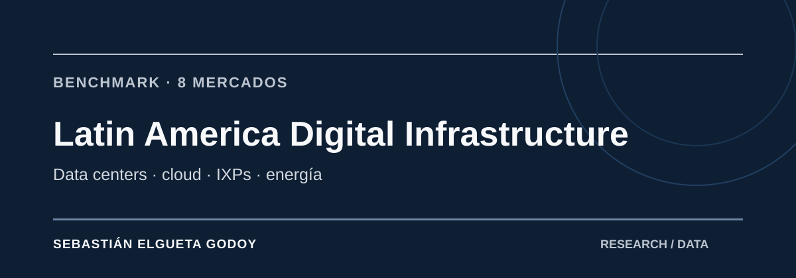
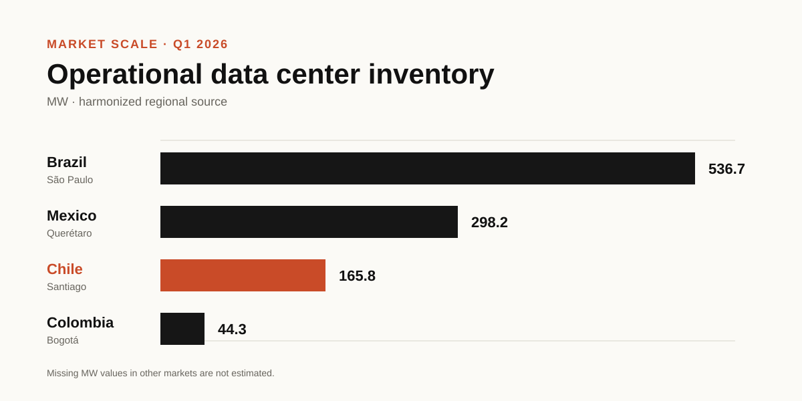
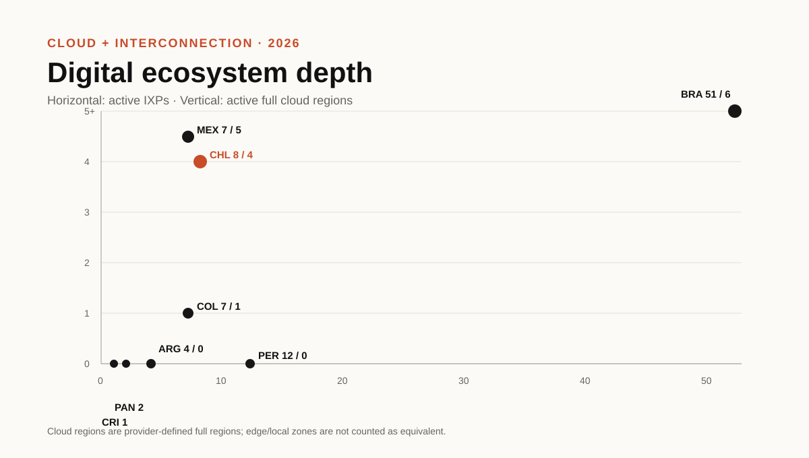
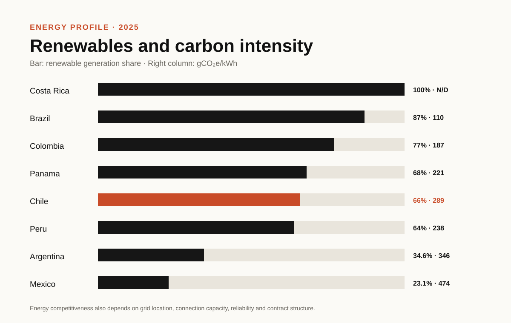

# Latin America Digital Infrastructure



**Latest release:** [v0.2.0](https://github.com/selguetagodoy/latin-america-digital-infrastructure/releases/tag/v0.2.0) · [Concept DOI: 10.5281/zenodo.22921174](https://doi.org/10.5281/zenodo.22921174) · [Version DOI: 10.5281/zenodo.22921175](https://doi.org/10.5281/zenodo.22921175)

[](https://doi.org/10.5281/zenodo.22921174)
[](https://github.com/selguetagodoy/latin-america-digital-infrastructure/actions/workflows/source-urls.yml) [](https://github.com/selguetagodoy/latin-america-digital-infrastructure/actions/workflows/data-check.yml)

**Public dataset landing page:** https://selguetagodoy.github.io/dataset-latin-america-digital-infrastructure.html  
**Author profile:** https://selguetagodoy.github.io/
**Thematic analysis:** [Data centers e infraestructura digital en Chile](https://selguetagodoy.github.io/infraestructura-digital.html)

Public, source-backed observatory for comparing digital infrastructure across Latin America.

The current release covers eight benchmark markets — Argentina, Brazil, Chile, Colombia, Costa Rica, Mexico, Panama and Peru — and combines country indicators with separate datasets for cloud, Internet exchange, submarine connectivity and operator market presence.

## Regional snapshot

- 8 benchmark markets
- 27 comparable variables
- 16 active full cloud regions
- 92 active IXPs
- 1,045 MW of comparable operational data-center inventory across four harmonized markets

## Visual analysis







## Current release — v0.2

Start with:

- `PROJECT_OVERVIEW.md` — project scope and benchmark markets
- `data/regional_benchmark_2026.csv` — 27 comparable variables across eight countries
- `data/cloud_regions.csv` — AWS, Google Cloud, Microsoft Azure and Oracle Cloud Infrastructure
- `data/ixps.csv` — initial Internet exchange inventory
- `data/submarine_cables.csv` — selected regional submarine systems
- `data/operator_country_presence.csv` — public operator presence by country and market
- `docs/key_findings.md` — principal analytical findings
- `docs/country_profiles.md` — eight concise country profiles
- `docs/data_dictionary.md` — field definitions
- `docs/methodology.md` — evidence and comparability rules
- `site/` — static observatory website prepared for publication
- `CHANGELOG.md` — release history

## Public affairs data

### [Chile State Institutional Map](https://github.com/selguetagodoy/chile-state-institutional-map-)

Independent companion repository with a machine-readable institutional map of the Chilean State for **public affairs, public policy, regulatory analysis and stakeholder mapping**. The current release contains 849 institutional records with explicit source and coverage controls.

## Reproducibility

Run:

```bash
python scripts/benchmark_summary.py
python scripts/coverage_summary.py
```

GitHub Actions runs the same checks on pushes and pull requests.

## Research principles

The repository keeps infrastructure categories separate, uses harmonized comparisons only when definitions are sufficiently comparable, preserves missing values instead of estimating them, and distinguishes operational from announced infrastructure.

The public release is intentionally analytical rather than a directory of individual facilities.

## Provenance and QA

The canonical evidence hierarchy is documented in [SOURCE_OF_TRUTH.md](SOURCE_OF_TRUTH.md). The new [sources.csv](sources.csv) maps the explicit `source_ref` families used by the cloud-region, IXP, submarine-cable and operator-presence layers to public source URLs. Those URLs are checked automatically every week.

**Current lineage status:** `data/metric_source_ledger.csv` now maps every column in `data/regional_benchmark_2026.csv` to an external source family, project metadata, or a reproducible derived transformation. This is complete **metric-level provenance**. The harmonized CSV still does not embed a separate source URL in every individual cell; detailed infrastructure tables retain row-level `source_ref` values where available.

## Author

**[Sebastián Elgueta Godoy](https://selguetagodoy.github.io/)** — sociologist and public affairs professional working on public policy, telecommunications, data centers, digital infrastructure, connectivity and comparative analysis in Latin America.

Profiles: [GitHub](https://github.com/selguetagodoy) · [LinkedIn](https://cl.linkedin.com/in/sebastian-elgueta-godoy) · [Substack](https://substack.com/@sebastianelguetagodoy) · [Coordenadas Públicas](https://www.coordenadaspublicas.cl/nosotros/)

## License

MIT for repository code. Third-party source data remain subject to the terms of their original publishers.

## Related research

- [Chile Digital Inclusion](https://selguetagodoy.github.io/dataset-chile-digital-inclusion.html) — territorial connectivity and digital inclusion in Chile.
- [Chile State Institutional Map](https://selguetagodoy.github.io/dataset-chile-state-institutional-map.html) — institutional structure for regulatory and public-affairs analysis.
- [Stakeholder Routes Chile](https://selguetagodoy.github.io/dataset-stakeholder-routes-chile.html) — decision routes for regulation and infrastructure projects.

